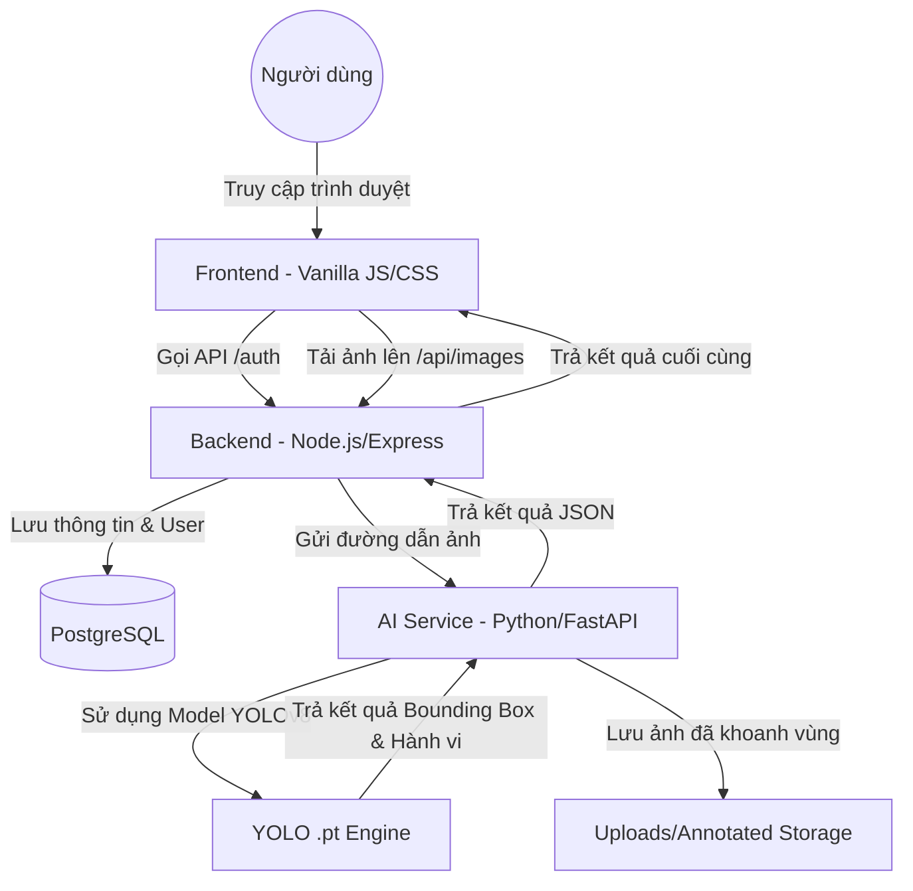

# Tài Liệu Giải Thích Cơ Chế Hoạt Động - Hệ Thống Cow-Visioning

Hệ thống **Cow-Visioning** là một giải pháp tích hợp giữa AI và Web để giám sát và phân tích hành vi của bò. Dự án được xây dựng theo kiến trúc Microservices tách biệt giữa phần xử lý giao diện (Web Back-end) và phần xử lý trí tuệ nhân tạo (AI Service).

---

## 1. Sơ Đồ Kiến Trúc Tổng Quan

---

## 2. Các Thành Phần Chính

### 2.1. Backend (Node.js / Express)
- **Thư mục:** Gốc (`server.js`)
- **Nhiệm vụ:**
    - Quản lý **Authentication**: Đăng nhập, phân quyền (Admin/User) dựa trên Session.
    - Quản lý **Database**: Kết nối với PostgreSQL trên VPS để lưu trữ nhật ký hình ảnh, thông tin bò và lịch sử phân tích.
    - **Điều phối (Orchestrator)**: Khi người dùng tải ảnh lên, Backend sẽ lưu ảnh gốc, sau đó "nhờ" AI Service phân tích. Sau khi có kết quả từ AI, nó sẽ lưu thông tin vào DB và trả về cho người dùng.

### 2.2. AI Service (Python / FastAPI / YOLOv8)
- **Thư mục:** `ai_service/`
- **Nhiệm vụ:**
    - Chạy một Server API riêng biệt (thường là port 8001).
    - Sử dụng thư viện **Ultralytics** để nạp Model YOLOv8 (`.pt`).
    - **Object Detection & Classification**: Nhận dạng con bò trong ảnh và phân loại hành vi (đứng, nằm, ăn, uống, đi bộ, bất thường).
    - **Annotation**: Vẽ khung (Bounding Box) và dãn nhãn lên ảnh, sau đó lưu lại phiên bản ảnh đã xử lý để hiển thị trên Dashboard.

### 2.3. Frontend (HTML / CSS / JS)
- **Thư mục:** `public/`
- **Nhiệm vụ:**
    - Cung cấp giao diện dashboard hiện đại cho người dùng.
    - **Dashboard theo thời gian thực**: Hiển thị ảnh vừa chụp kèm theo nhãn hành vi AI vừa nhận diện.
    - **Thống kê**: Hiển thị biểu đồ và danh sách dữ liệu lịch sử từ database.

### 2.4. Cơ Sở Dữ Liệu (PostgreSQL)
- **Nhiệm vụ:** 
    - Lưu trữ danh sách User.
    - Lưu trữ bảng `cow_images`: Chứa các thông tin cực kỳ chi tiết bao gồm: ID bò, hành vi (behavior), độ tin cậy (confidence), tọa độ khung (primary_box), và đường dẫn ảnh.

---

## 3. Quy Trình Hoạt Động (Workflow)

1. **Đăng nhập:** Người dùng nhập tài khoản. Backend kiểm tra trong bảng `users` ở DB VPS. Nếu đúng, cấp Session Token.
2. **Tải ảnh/Giám sát:** Người dùng chụp ảnh hoặc tải ảnh bò lên hệ thống qua Dashboard.
3. **Xử lý AI:**
    - Backend nhận file, lưu vào thư mục `uploads/`.
    - Backend gửi yêu cầu POST tới AI Service (`/predict`) kèm đường dẫn file ảnh vừa lưu.
    - AI Service nạp ảnh, dùng Model YOLO nhận diện.
    - AI Service lưu file ảnh mới (đã vẽ khung) vào thư mục `uploads/annotated/`.
4. **Lưu trữ & Hiển thị:**
    - AI Service trả kết quả (ví dụ: "Sức khỏe: Tốt - Hành vi: Đang ăn - Độ tin cậy: 95%").
    - Backend lưu tất cả thông tin này vào PostgreSQL.
    - Frontend nhận được phản hồi và hiển thị ngay lập tức lên màn hình giám sát.

---

## 4. Công Nghệ Sử Dụng (Tech Stack)

| Thành phần | Công nghệ |
| :--- | :--- |
| **Giao diện** | HTML5, Vanilla CSS (Modern UI), Javascript (ES6) |
| **Server chính** | Node.js, Express.js |
| **Trí tuệ nhân tạo** | Python, FastAPI, Ultralytics YOLOv8 |
| **Cơ sở dữ liệu** | PostgreSQL 14 |
| **Quản lý quy trình** | PM2 (chạy ngầm Server trên VPS) |
| **Web Server** | Nginx (Reverse Proxy) |

---
*Tài liệu hướng dẫn cấu trúc và vận hành hệ thống Cow-Visioning.*
